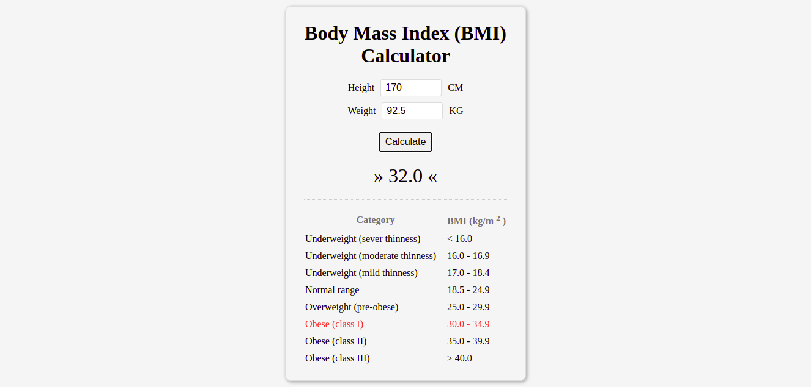

# Body Mass Index (BMI) Calculator

Calculates BMI based on weight and height.

## Features

- calculates BMI
- selects category (result description) based on BMI

## Technologies used

- HTML
- CSS
- JavaScript

## Preview

Live demo: [click here](https://pawelpohland.github.io/bmi-calculator/)

